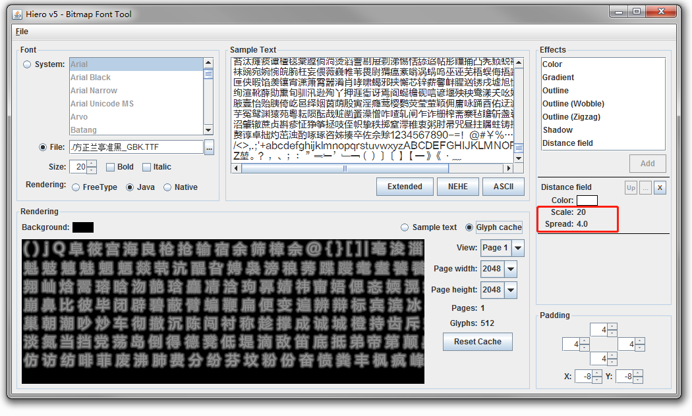

# CCMSDFLabel

## 概述
本组件为Cocos Creator 用户提供了一种基于SDF的字体渲染实现。

渲染效果图：(上面是普通Bitmap Font，下面是SDF渲染效果)

## 为什么要在小游戏中使用SDF字体
1. 小游戏 ios平台10.1.x的系统，系统字体会出现渲染错误，具体表现为所有的系统字体显示的文本内容一样。
2. 系统字体每一个Label实例都会在底层创建一张纹理。
3. 如果使用BMFont，不同的字体效果（描边、阴影），不同大小需要制作不同的BMFont，浪费内存

SDF字体只需要制作一份字体图集就可以支持所有的字号和字体效果（描边，阴影，渐变）。并且，SDF在不同的分辨率下面，显示的效果非常好，支持无损放大。

目前Unity 2018已经集成的TextMesh Pro也是采用的SDF字体渲染方案。

# 组件已支持特性
1. 单通道SDF Label组件：支持3500常用汉字
2. 单通道SDF RichText组件：支持Creator的富文本的所有功能
2. 支持描边，阴影等特效

## 使用方法

跟引擎自带的Label和RichText组件一样，具体方法可以参考引擎文档：

Label组件参考： https://docs.cocos.com/creator/manual/zh/components/label.html

RichText组件参考： https://docs.cocos.com/creator/manual/zh/components/richtext.html?h=richtext

**温馨提示： 在设置组件的行高的时候，需要把行高设置为字体的大小**

# 常用问题
## 1. 渲染的文字边缘有一些毛刺？
可以调整SDF生成的字号大小，本项目中使用的是20号，如果换一个更精细的字体，可能需要增加这个字号。

## 2. 渲染描边或者阴影效果的时候，会出现一些“脏东西”
可以在生成SDF字体的时候，适当添加一些padding和scale(一般padding的大小要大于字号的1/10），同时可以适当增加hiero的scale。 Hiero 软件下载地址： https://github.com/libgdx/libgdx/wiki/Hiero

