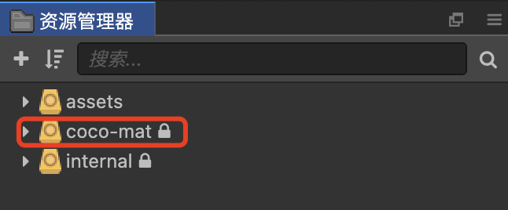
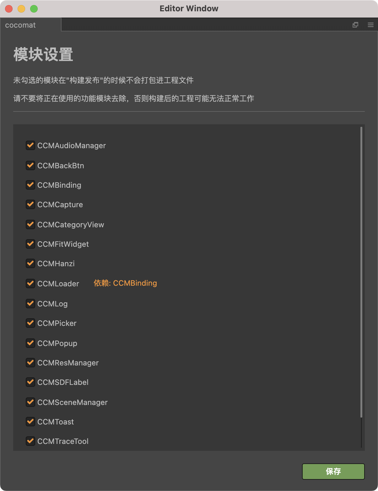

# 用法

将 `cocomat` 插件存放到项目的package目录下即可使用。 

## **文件**  
插件导入后可以在资源管理器里看到 `coco-mat` 的库文件夹。  

源文件会移动到：`[项目根目录]/coco-mat`。

## **菜单**  

【扩展】菜单 → `cocomat`。

## **界面**

【扩展】菜单 → 【cocomat】→ 【设置】可以打开模块设置界面。在这个界面下可以对不需要的模块进行剔除，如果将项目正在使用的模块剔除会引起编辑器报错。

